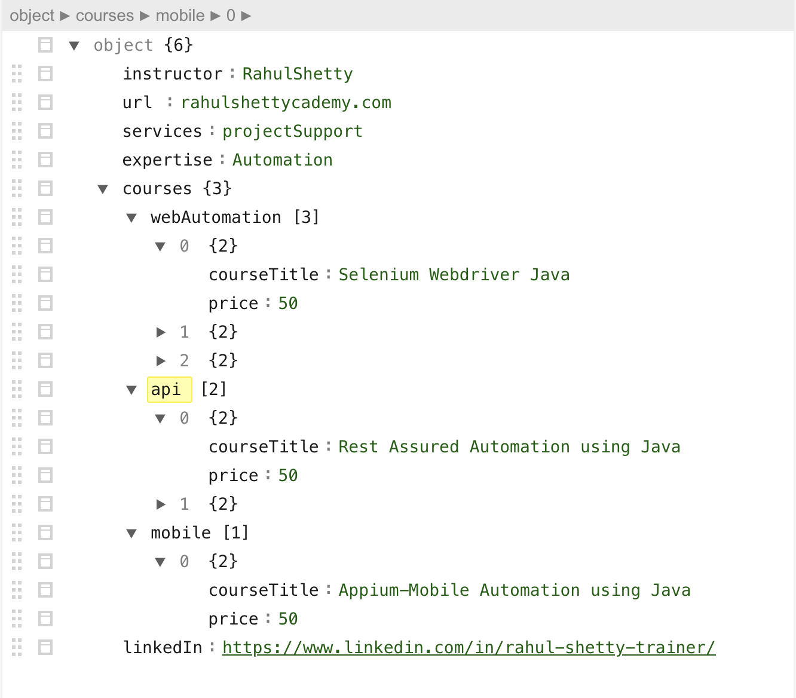
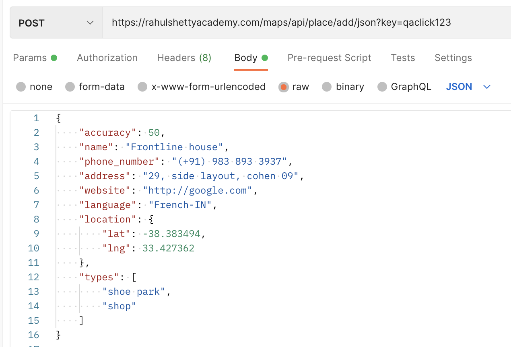

# Links for Practice

<a href="https://rahulshettyacademy.com/#/practice-project"> https://rahulshettyacademy.com/#/practice-project</a>
<br>
<a href="https://drive.google.com/file/d/1A3Q_HX8A_GtamXs5kpdZ_7jM8W-OajKS/view">https://drive.google.com/file/d/1A3Q_HX8A_GtamXs5kpdZ_7jM8W-OajKS/view </a>

------------------------------------------------------------------------------------
# Steps to setup jira

download from this link:
https://www.atlassian.com/software/jira/download-journey

For Installation refer : https://thoughtworks.udemy.com/course/rest-api-automation-testing-rest-assured/learn/lecture/6580656#questions/2349046

To Start JIRA in my local
Go to /Applications/atlassian-jira-software-8.22.0-standalone/bin
sh start-jira.sh

Now go to: http://localhost:8080/ 
click next next and give all details

Organization name: sriram
JIRA Server Key:
B9CC-7WB7-5EV9-3O5V

email: sriramkukkadapu@gmail.com
username: sriramkukkadapu
pwd: test123

project name created 
RSA

JIRA API docs for documentation:
https://docs.atlassian.com/software/jira/docs/api/REST/7.6.1/

Set JIRA to allow attachments  here it should be turned ON
http://localhost:8080/secure/admin/ViewAttachmentSettings.jspa

# Important Notes


To ignore HTTPS certificate validation by rest assured give this in given section <br>

```java
	given().relaxedHTTPSValidation()
```

------------------------------------------------------------------------------------		
SessionFilter -> is used to filter session from auth api and pass it across the entire test script.

```java
	SessionFilter  session = new SessionFilter(); 
	 given() 
		.filter(session) 
		.post("<auth api url>") 
```
	
subsequent API's this session can be used like below.

```java
	given() 
		.filter(session) 
		.when().post("<add user url>")
```
------------------------------------------------------------------------------------		

Attach files in request

```java
	given()
		.header("Content-Type","multipart/form-data")
		.pathParam("id", issueId )
		.filter(session)
		.multiPart("file", new File("attachment.png"))
		.when().post("rest/api/2/issue/{id}/attachments")
		.then().log().all().assertThat().statusCode(200);
```

------------------------------------------------------------------------------------		
# Post Example:

```java
	RestAssured.baseURI = "http://216.10.245.166";
	String response = 
		given()
			.log().all()
			.header("Content-Type","application/json")
			.body(Payload.addBook("jahsgdasd","761253"))
		.when()
			.post("/Library/Addbook.php")
		.then()
			.assertThat().statusCode(200).extract().response().asString();
	
	JsonPath  path = ReusableMethods.rawToJson(response);
	String id = path.getString("ID");
	System.out.println(id);	
```
------------------------------------------------------------------------------------		
# Reading JSON data from file to add it in request

```java
	String fileData = new String(Files.readAllBytes(Paths.get("datafiles/addPlace.json")));	
```

# Serialization and De-serialization

For this we use below dependencies in pom.xml

Jackson data bind
https://mvnrepository.com/artifact/com.fasterxml.jackson.core/jackson-databind/2.13.2

jackson annotations
https://mvnrepository.com/artifact/com.fasterxml.jackson.core/jackson-annotations/2.13.2

jackson core
https://mvnrepository.com/artifact/com.fasterxml.jackson.core/jackson-core/2.13.2

Gson
https://mvnrepository.com/artifact/com.google.code.gson/gson/2.9.0


# Example Java code for De-serialization

JSON Structure for example



```java 
GetCourse gc = given()
			.queryParam("access_token", access_token)
			.expect().defaultParser(Parser.JSON)
		.when()
			.get("https://rahulshettyacademy.com/getCourse.php").as(GetCourse.class);
		System.out.println("===========");
		System.out.println(gc.getLinkedIn());
		System.out.println(gc.getInstructor());
		gc.printData();
//		System.out.println(response);
		
		System.out.println("===========");
		System.out.println(gc.getCourses().getApi().get(1).getCourseTitle());
		System.out.println(gc.getCourses().getApi().get(1).getPrice());
		
		System.out.println("===========");
		List<API> apiList = gc.getCourses().getApi();
		for(int i=0;i<apiList.size();i++) {
			if(apiList.get(i).getCourseTitle().equals("SoapUI Webservices testing")) {
				System.out.println(apiList.get(i).getPrice());
			}
		}
		
		System.out.println("===========");
		List<WebAutomation> waList  = gc.getCourses().getWebAutomation();
		for(int i=0;i<waList.size();i++) {
				System.out.println(waList.get(i).getCourseTitle());
		}
```

#Example Java code for Serialization

Sample Json for serialisation is below.


Java code for serializing above JSON => preparing JSON data as a Java object and sending it in the request.

```java
AddPlace p = new AddPlace();
		p.setAccuracy(50);
		p.setAddress("29, side layout, cohen 09");
		p.setLanguage("French-IN");
		
		Location location = new Location();
		location.setLat(-38.383494);
		location.setLng(33.427362);
		
		p.setLocation(location);
		
		p.setName("Frontline house");
		List<String> types = new ArrayList<String>();
		types.add("shoe park");
		types.add("shop");
		
		p.setTypes(types);
		p.setPhone_number("(+91) 983 893 3937");
		p.setWebsite("http://google.com");
		
		Response response = 
				given()
					.header("Content-Type","application/json")
					.queryParam("key", "qaclick123")
					.body(p)
					.log().all()
				.when()
					.post("maps/api/place/add/json")
				.then()
					.assertThat().statusCode(200)
					.extract().response();

		System.out.println("============");
		System.out.println(response.asString());
```

		


